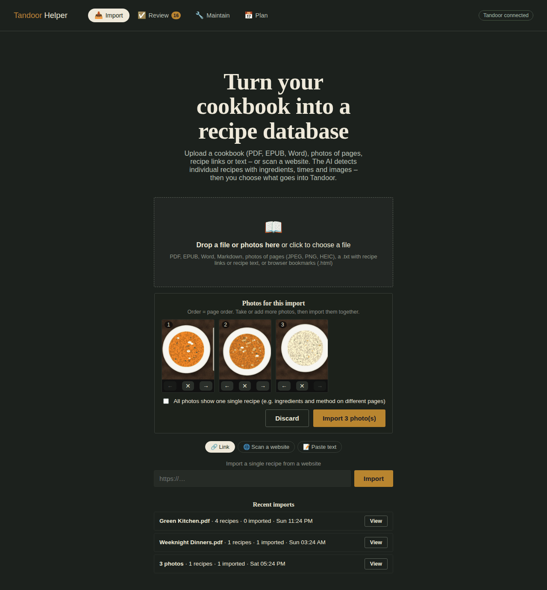
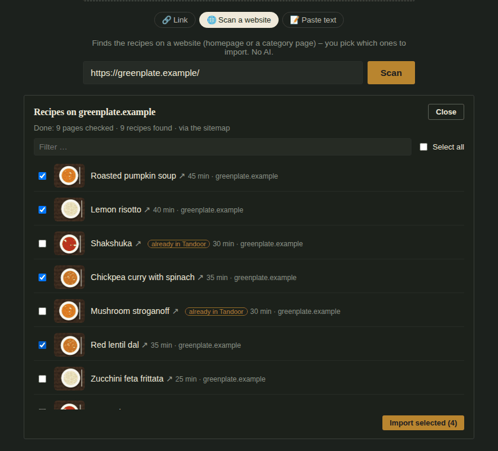
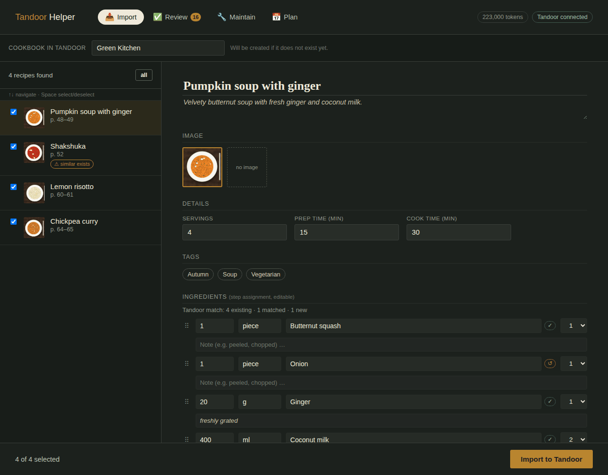
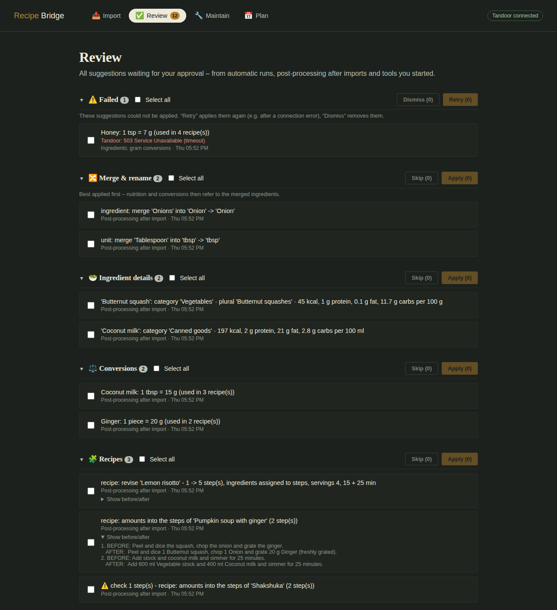
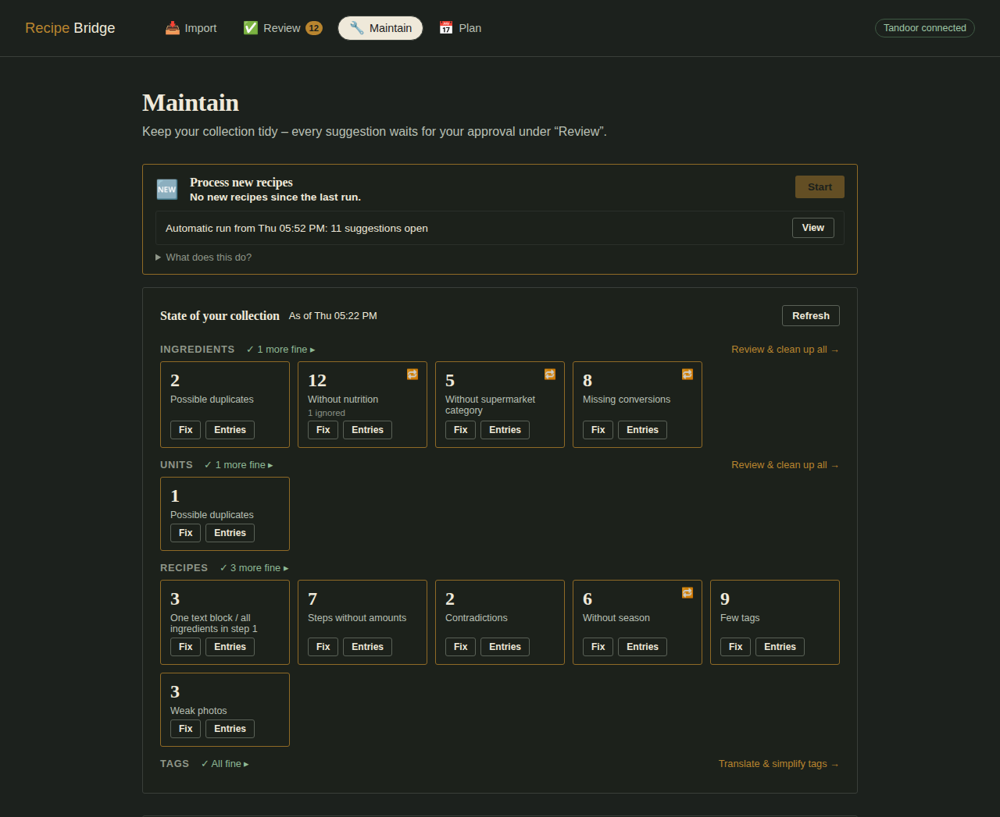
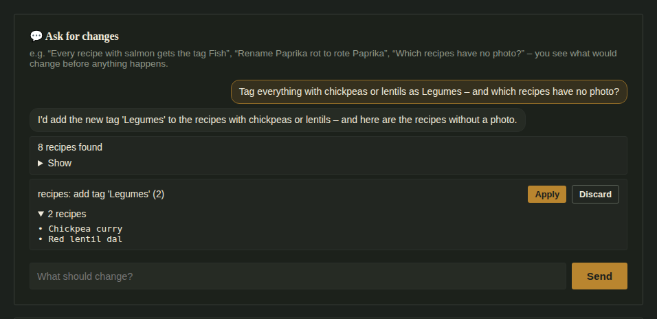
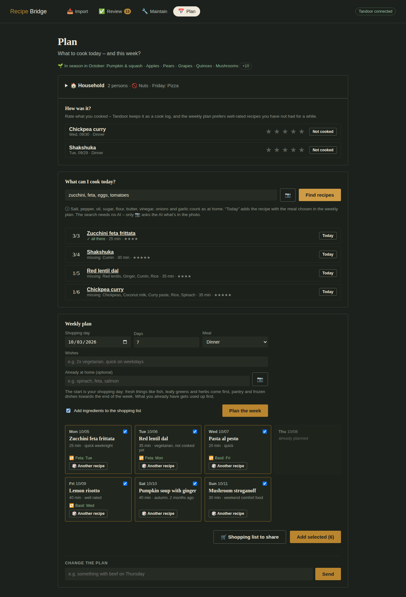
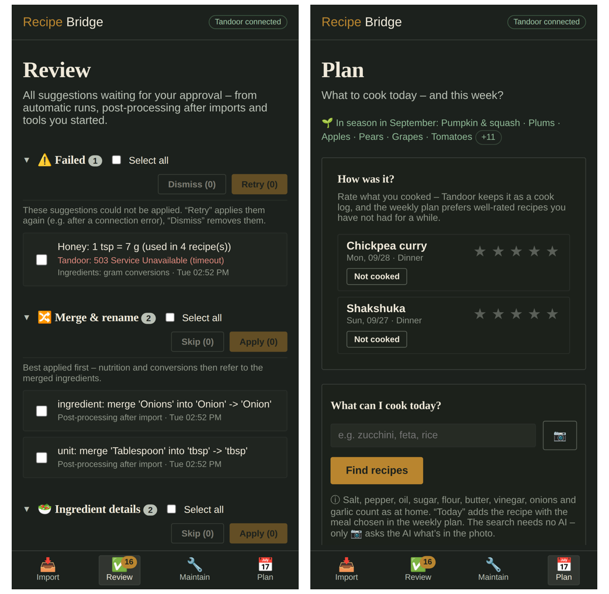

# Recipe Bridge

A companion web app for your self-hosted recipe manager –
[Tandoor Recipes](https://tandoor.dev/) or [Mealie](https://mealie.io/).
It **imports recipes from almost anywhere** – cookbooks (PDF, EPUB, Word),
phone photos and handwritten cards, web pages, whole recipe websites,
cooking videos, voice notes, browser bookmarks, pasted text – with the help
of an AI (Claude, ChatGPT, Gemini or a local model), **keeps your collection
tidy** (duplicates, translations, tags, nutrition, unit conversions,
contradictions, weak photos … – or just ask in a chat) and **helps you plan
meals** from your own recipes, for your household. It never changes anything behind your back: every change is shown
as a suggestion first, and with Tandoor applied changes can be undone.

> **Beta** – version 1.0 is feature-complete but hasn't run on many
> installations yet; the Mealie support in particular is new. Please report
> problems as [issues](https://github.com/carllvin/recipe-bridge/issues).

<p align="center">
  
</p>

- [What it does](#what-it-does)
  - [📥 Import](#-import) · [✅ Review](#-review) · [🔧 Maintain](#-maintain) · [📅 Plan](#-plan) · [On the phone](#on-the-phone)
- [Tandoor or Mealie](#tandoor-or-mealie)
- [Setup](#setup) · [Updating](#updating)
- [Configuration](#configuration)
- [AI providers and costs](#ai-providers-and-costs)
- [Data and backups](#data-and-backups)
- [Command-line scripts](#command-line-scripts)
- [A note on the recipe managers' APIs](#a-note-on-the-recipe-managers-apis)
- [Architecture](#architecture) · [Tests](#tests) · [Known limitations](#known-limitations)

## What it does

The app has four areas, reachable from the top bar (on the phone: the bottom
bar). Texts in the app name your recipe manager – "Tandoor" or "Mealie".

### 📥 Import

**Files** – drop them on the import area or click to choose:

- **Cookbooks as PDF, EPUB or Word (.docx)** – the AI reads every page (in
  overlapping chunks, so books with hundreds of pages work), finds each
  recipe with its page range, ingredients, steps, times, servings, tags and
  photo. Pictures embedded in a Word document become photo candidates.
- **Photos of cookbook pages** – drop them in or, on the phone, take them one
  by one with the camera. They are collected first, can be reordered and
  removed, and are imported together; tick *"all photos show one single
  recipe"* when ingredients and method are on different pages. Scans and
  photos go through OCR (Tesseract) with deskewing, cropping and two-page
  spread detection.
- **Handwriting** – for recipe cards and notes, tick *handwriting*: the AI
  reads the photos itself instead of the OCR (costs a little more).
- **A `.txt` file** – either a **list of recipe links** (one per line, or any
  text containing links; up to 50) or **recipe text**; the app tells them
  apart by the content. Markdown files (`.md`) are read as text.
- **Browser bookmarks** – the HTML export of Chrome, Firefox, Safari or Edge
  opens a pick list with the bookmark folders as a filter.

**From the web and the clipboard** – one field below the import area; the
app recognizes what you paste:

- **A recipe page** – imported directly. **🌐 Scan the whole website**
  instead looks for more recipes on the same site: via its sitemap, or by
  following the links of the page you entered up to the chosen **depth**
  (1–4 levels, incl. "page 2, 3 …") – and recognizes them by the recipe
  data they embed (schema.org), **without AI**. Results show up while it
  runs, with photo, time and an *already in your collection* mark; you pick
  which ones to import. It respects the site's `robots.txt`, reads at most
  one page per second and checks up to 300 pages.
- **A cooking video** from **YouTube, Instagram or TikTok** – the AI reads
  the recipe from the description or caption, and for YouTube also from the
  subtitles (what is said in the video). If a site only shows a login page,
  the app says so – then paste the caption as text.
- **Recipe text** – from a message, an email or a note.

**🎙️ Dictate a recipe** – record it in the app (or share / drop a voice note:
m4a, mp3, ogg, opus, wav, webm). It is transcribed and then read like a
pasted text. Needs an OpenAI or Gemini key (also when `AI_PROVIDER` is
`anthropic`) or a local transcription model, see
[Local AI](#local-ai-ollama--co).

<p align="center">
  
</p>

Links (single, from a list, a scan or bookmarks) are read one page at a
time – the page's schema.org recipe data is used when present – and each
recipe keeps its link as the source. Links that can't be loaded or contain
no recipe are skipped and listed in the review.

**More ways in** (under *More ways* on the import page):

- **📱 Share from the phone** – install the app on your phone (browser menu →
  *Install app* / *Add to home screen*; needs HTTPS). It then shows up in the
  share menu: links, text and photos land right in the import.
- **🔖 Bookmark button** – drag it to your browser's bookmark bar; one click
  on a recipe page sends it to the app.
- **📂 Watched folder** – files put into a folder (`WATCH_DIR`) are imported
  on their own and wait under ✅ Review → *New imports*.
- **🚚 Move from Tandoor / Mealie** – when both are configured, all recipes
  (or one cookbook) of the other recipe manager come over **without AI**:
  ingredient sections, steps, times, tags, photos and source links. They go
  through the normal review (recipes that exist already are deselected) and
  into the cookbooks they were in before.

Everything is **translated into your language** (`OUTPUT_LANGUAGE`) and
**converted to metric** on the way.

> **Recipes from other apps** (Paprika, Nextcloud Cookbook, RecipeSage, …):
> Tandoor and Mealie import their export files themselves. Afterwards run
> **Process new recipes** on the 🔧 Maintain page to translate them, match
> their ingredients to yours and add tags.

Before anything goes into your collection you review the result – and the
review covers everything, so nothing has to be checked again afterwards:

<p align="center">
  
</p>

- Edit title, description, servings, times, tags, ingredients and steps;
  pick or deselect the photo.
- Each ingredient is assigned to the step that needs it (dropdown on the
  right), so the ingredients show up at the right step.
- Ingredients, units and tags are matched against your collection:
  ✓ exists · ↺ matched to an existing entry ("onions" → "Onion") · new. A
  matched entry shows what was read below it ("read as: onions").
- Recipes that probably exist already are flagged (exact matches are
  deselected). With an image AI, missing photos can be generated and the
  recipe's own photos improved (light, colors, sharpness – the dish stays
  as it is), one by one or for all recipes while importing.
- **Import** puts the selected recipes into a cookbook – pick an existing
  one or create a new one (with Mealie a category); failed ones can be retried on their own and an
  import can be undone. With Tandoor, the new ingredients then get their
  details (plural, nutrition, supermarket category, gram conversions) filled
  in automatically – shown under ✅ Review → *Recently applied*, with undo.

### ✅ Review

One inbox for every suggestion – from automatic runs, from tools you
started and imports that arrived without you (phone, watched folder) –
grouped by kind:

<p align="center">
  
</p>

- **Merge & rename** duplicates (ingredients, units, tags), **ingredient
  details** (plural, nutrition, supermarket category), **gram conversions**,
  **recipe revisions** (one block of text split into steps, ingredients
  assigned to steps – with a before/after preview), **translations**,
  **tags & season**, **servings**, **photos**, **amounts in the steps**,
  **contradictions** and **unused entries**. (The weekly plan is reviewed
  and added on the 📅 Plan page itself.)
- When an ingredient like *gemahlene Mandeln* is renamed to or merged into
  *Mandeln*, the preparation (*gemahlen*) goes into the note of every
  recipe line that used it.
- Suggestions marked **⚠️** need a look first (e.g. a sentence that may not
  read well, a change to many recipes) – *Select all* leaves them out.
- Tick what you want and **Apply** or **Skip**. Applying runs **in the
  background on the server**, strictly one after another – you can close the
  page; the queue even survives a restart.
- Suggestions that failed (e.g. the recipe manager was briefly unreachable)
  stay in a **Failed** group with the error: *Retry* or *Dismiss*.
- **Recently applied** lists what was changed in the last 14 days. With
  Tandoor any of it can be **undone**, including merges (the merged-away
  ingredient is recreated and the recipes point to it again).

### 🔧 Maintain

<p align="center">
  
</p>

- **Process new recipes** handles recipes added since the last run directly
  in your recipe manager (URL import, app, by hand): translates them right
  away, then suggests revising their structure, matching their
  ingredients/units/tags to existing ones, filling in ingredient details and
  conversions (Tandoor) and adding tags. Recipes imported through this app
  were already covered by the review – they only get the *amounts into the
  steps* (see below), applied right away like the ingredient details;
  only ones marked ⚠️ wait for review.
- **State of your collection** counts what's left to do – without AI – in
  groups:
  - *Ingredients*: possible duplicates, without nutrition or supermarket
    category, missing conversions, unused;
  - *Units*: possible duplicates, unused;
  - *Recipes*: not in your language, one block of text / all ingredients in
    step 1, steps without amounts, contradictions, without a season, few
    tags, without servings, without a photo, weak photos;
  - *Tags*: not in a tag group, unused.

  **Fix** starts the tool for exactly that tile (e.g. only the likely
  duplicates go to the AI, not your whole ingredient list). **Entries** lists
  them; single entries can be **ignored** (e.g. *Water* without nutrition)
  and are never suggested again. Each group also has a tool for the whole
  collection (all ingredients, all units, tag translate & simplify). Tiles
  show when a fix is running or waiting for review, and the overview
  recounts on its own after you applied something.
- **Steps without amounts** – "Das Mehl mit der Milch verrühren" becomes
  "250 g Mehl mit 500 ml Milch verrühren", with an ingredient's comment in
  brackets. The AI only marks where an ingredient is mentioned – it never
  writes a number: with Tandoor the step gets Tandoor's templates
  (`{{ ingredients[0] }}`), so the amounts follow when you change the
  servings; with Mealie they are written out. A second AI pass proofreads
  each step as it will read; doubtful ones are marked ⚠️.
- **Contradictions** (recipe doctor) – found without AI: an ingredient no
  step mentions, a step naming an ingredient that isn't in the list, an
  amount that can't be right (400 g salt for 4 servings), a time that
  doesn't fit the method. Only for those, the AI proposes a fix; if it finds
  a false alarm, the recipe goes on the tile's ignore list.
- **Weak photos** – too dark, too bright, washed out, blurry or too small,
  measured from the pixels **without AI** (each photo once). Applying a
  suggestion improves the photo with the image AI (`IMAGE_GEN_ENABLED`).
- **💬 Changes by chat** – ask in plain words: "every recipe with salmon gets
  the tag Fisch", "rename Paprika rot to rote Paprika", "put all soups into
  the cookbook Winter", "which recipes have no photo?". The AI only picks
  from a fixed set of actions (rename/merge ingredients, units, tags;
  add/remove/delete tags; servings; cookbook; supermarket category; find)
  and describes which recipes are meant – the app finds them itself. Every
  change is shown with the recipes it touches and applied only on a click;
  changes to more than 50 recipes and deleting a tag need a second click. A
  warning has to be confirmed once before the chat can be used.

  <p align="center">
    
  </p>
- **Automation & budget** (stored in the app, no restart needed):
  - *Automatic maintenance* – at a chosen time every N days, prepare
    suggestions for the selected tiles.
  - *Monthly AI budget* – a token limit; once reached, automatic runs pause
    until the next month (optionally manual starts and imports too).
  - *Notifications* – a test message for the configured channels.
  - *AI usage* of the last 30 days per tool.

### 📅 Plan

<p align="center">
  
</p>

- **🏠 Household** – how many people eat, what must **never** be in a dish
  (allergies, intolerances), what you'd **rather not** eat, and fixed wishes
  per weekday ("Friday: pizza"), plus **nutrition goals**: max. kcal and
  min. protein per serving and more in words ("2x fish a week, little red
  meat"). The weekly plan, its chat and *what can I cook today?* follow it:
  recipes with a "never" ingredient are left out, disliked ones come last,
  recipes known to be above the kcal limit don't get planned (energy and
  protein per serving come from Tandoor's computed nutrition or Mealie's
  nutrition), and planned days get the number of persons as servings (the
  shopping list scales the amounts).
- **How was it?** – rate the meals you planned in the last days. With
  Tandoor the rating goes in as a cook log, with Mealie as your rating plus
  the recipe's "last made" date – either way the weekly plan uses it.
- **What can I cook today?** – type what you have at home, or take a
  **photo of the fridge** and let the AI list what it sees, and get matching
  recipes from your collection (the matching needs no AI; "tomato" also
  finds "cherry tomatoes"). Salt, pepper, oil, sugar, flour, butter,
  vinegar, onions and garlic count as always at home. *Plan for today* puts
  a recipe on the meal plan.
- **Weekly plan** – the AI picks one of your recipes per day:
  - the week starts on your **shopping day** (the coming Saturday by
    default): recipes with quickly perishing ingredients – fresh fish, mince,
    leafy greens, herbs, berries – come first, pantry and frozen dishes
    towards the end;
  - it prefers recipes that use what's **already at home** (typed or from a
    fridge photo), and **uses up rests**: an ingredient that usually leaves
    a rest (cream, fresh herbs, feta …) is planned again a day or two later
    – each day shows it ("🔁 Feta: Tue");
  - it follows your wishes ("2x vegetarian, quick on weekdays"), the season,
    variety, your ratings and how long ago you cooked something;
  - days that are already planned are left out, any day can be re-rolled,
    and a **chat** below the week changes it on request ("something with
    beef on Thursday", "swap Monday and Wednesday");
  - the selected days go into the meal plan, optionally with the
    ingredients on the shopping list;
  - **🛒 Shopping list to share** – the ingredients of the planned days
    added up, scaled to the household and grouped by supermarket aisle
    (Tandoor's categories, Mealie's labels), as text for a messenger or to
    copy; staples and what's at home come under *check the pantry*;
  - **🔪 Meal-prep plan** – one work plan for the planned (or selected)
    days, to cook ahead in one session: shared preparation done once with
    the combined amounts ("dice 3 onions for the soup and the curry"), oven
    and hob in parallel, the longest things first, and how to keep what's
    prepared.
- **🥂 Guest menu** – occasion, day, number of guests, courses (starter,
  soup, main, side, dessert), what the guests can't eat and wishes: the AI
  puts together a menu from your recipes – one per course, matching each
  other (no main ingredient twice, not three heavy courses), the
  household's and the guests' "never" ingredients left out. Swap any course
  on its own, put the whole menu into the meal plan with the guests as
  servings, get its **shopping list** and a **🔪 work plan** with clock
  times counting back from "ready at 19:30". (Tags like *Dessert* or
  *Starter* on your recipes help it pick the right ones.)

### On the phone

The whole app works on the phone – with a bottom navigation, the camera for
cookbook and fridge photos, the share menu for links, and the review inbox
for approving suggestions on the go. Optional push notifications (ntfy or
Telegram) tell you when an import is ready, automatic runs prepared
suggestions or the AI budget runs low.

<p align="center">
  
</p>

## Tandoor or Mealie

`RECIPE_MANAGER` chooses which one the app works with (`tandoor` by
default).

| | Tandoor | Mealie |
|---|---|---|
| Import (all sources), review, matching | ✓ | ✓ |
| Weekly plan, what can I cook today, how was it, household, shopping list to share | ✓ | ✓ (rating + "last made" instead of a cook log) |
| Duplicates, unused entries, servings, photos | ✓ | ✓ |
| Tags (clean up, season, more tags), translate & revise recipes, process new recipes | ✓ | ✓ |
| Amounts into the steps | ✓ (templates – follow the servings) | ✓ (written out) |
| Contradictions, weak photos, changes by chat | ✓ | ✓ (chat without supermarket categories) |
| Moving recipes from the other one | ✓ | ✓ |
| Automatic maintenance | ✓ | ✓ (for the tiles above) |
| Nutrition, supermarket categories, unit conversions, tag groups | ✓ | – (no matching data model) |
| Undo applied changes | ✓ | – (every change is still reviewed first) |

With Mealie, the cookbook name of an import becomes a category (Mealie's
cookbooks are saved filters, e.g. on a category), and meal types are
Mealie's fixed ones (breakfast, lunch, dinner, …).

## Setup

You need Docker (with Compose), a running Tandoor or Mealie instance and an
API key for one AI provider. The app comes as a ready-made image
(`ghcr.io/carllvin/recipe-bridge`, for amd64 and arm64 – e.g. a Raspberry
Pi or a Synology), so there's nothing to build.

1. **Get the two files** into a new folder:

   ```bash
   mkdir recipe-bridge && cd recipe-bridge
   curl -O https://raw.githubusercontent.com/carllvin/recipe-bridge/main/docker-compose.yml
   curl -o .env https://raw.githubusercontent.com/carllvin/recipe-bridge/main/.env.example
   ```

2. **Fill in `.env`** – at least:
   - `AI_PROVIDER` – `anthropic` (Claude), `openai` (ChatGPT), `gemini`
     (Google) or `compatible` (a local model, see [Local AI](#local-ai-ollama--co))
   - the matching API key (`ANTHROPIC_API_KEY`, `OPENAI_API_KEY` or
     `GEMINI_API_KEY`), or `COMPATIBLE_BASE_URL` and `COMPATIBLE_MODEL`
   - **Tandoor:** `TANDOOR_URL` (**without** a trailing slash) and
     `TANDOOR_TOKEN` (in Tandoor: *user menu → Settings → API → create new
     token*)
   - **or Mealie:** `RECIPE_MANAGER=mealie`, `MEALIE_URL` and `MEALIE_TOKEN`
     (in Mealie: *user profile → API tokens*)
   - `OUTPUT_LANGUAGE` – e.g. `Deutsch` (recipes **and** the app's UI)
   - `TZ` – e.g. `Europe/Berlin`, so automatic runs happen at your local time

3. **Start it**

   ```bash
   docker compose up -d
   ```

4. Open **http://localhost:8420** (change the port in `docker-compose.yml`
   if you like). The badge in the top right shows whether your recipe
   manager is reachable.

With Portainer, Unraid, Synology Container Manager & co., paste
`docker-compose.yml` as a new stack and put the settings from `.env.example`
into its environment / `.env`.

`:latest` follows the main branch; for a fixed version use e.g.
`image: ghcr.io/carllvin/recipe-bridge:1.0` (see the
[packages page](https://github.com/carllvin/recipe-bridge/pkgs/container/recipe-bridge)
for the versions).

**Access from outside:** set `APP_PASSWORD` – each device then signs in once
and stays signed in. For the phone's share menu and app install the app
must be reachable via **HTTPS**, e.g. behind the same reverse proxy as your
recipe manager.

**Building it yourself** (e.g. to change the code or add Tesseract
languages): clone the repository, create `.env` as above and run

```bash
docker compose -f docker-compose.yml -f docker-compose.build.yml up -d --build
```

## Updating

```bash
docker compose pull
docker compose up -d
```

Your data (settings, open suggestions, undo history …) lives in a Docker
volume and survives updates – see [Data and backups](#data-and-backups).
If you build it yourself: `git pull` and the build command above.

## Configuration

### In the app

*Automatic maintenance* and the *monthly AI budget* are set on the 🔧
Maintain page, the *household profile* on the 📅 Plan page – stored in the
data volume, no restart needed.

### `.env`

`.env.example` lists every option with a comment. The most important ones:

| Variable | Default | Meaning |
|---|---|---|
| `AI_PROVIDER` | `anthropic` | `anthropic`, `openai`, `gemini` or `compatible` (any OpenAI-compatible API) |
| `ANTHROPIC_API_KEY` / `CLAUDE_MODEL` | – / `claude-sonnet-4-6` | Used when `AI_PROVIDER=anthropic` |
| `OPENAI_API_KEY` / `OPENAI_MODEL` | – / `gpt-4o` | Used when `AI_PROVIDER=openai` |
| `GEMINI_API_KEY` / `GEMINI_MODEL` | – / `gemini-2.5-flash` | Used when `AI_PROVIDER=gemini` |
| `COMPATIBLE_BASE_URL` / `COMPATIBLE_MODEL` / `COMPATIBLE_API_KEY` | – | Used when `AI_PROVIDER=compatible`, see [Local AI](#local-ai-ollama--co) |
| `OPENAI_TRANSCRIBE_MODEL` / `COMPATIBLE_TRANSCRIBE_MODEL` | `gpt-4o-mini-transcribe` / – | Speech-to-text for voice notes (OpenAI, or a local server; Gemini transcribes with its main model) |
| `CLAUDE_TOOLS_MODEL` / `OPENAI_TOOLS_MODEL` / `GEMINI_TOOLS_MODEL` | `claude-haiku-4-5-20251001` / – / – | Cheaper model for the maintenance tools and the weekly plan. Cookbook extraction and recipe translation keep the main model. Empty = main model |
| `RECIPE_MANAGER` | `tandoor` | `tandoor` or `mealie` |
| `TANDOOR_URL` / `TANDOOR_TOKEN` | – | Your Tandoor instance and API token |
| `MEALIE_URL` / `MEALIE_TOKEN` | – | Your Mealie instance and API token |
| `OUTPUT_LANGUAGE` | `English` | Language of the recipes **and** of the app's UI (full UI translations: Deutsch, English, Français, Italiano, Español) |
| `APP_PASSWORD` | *(empty = none)* | Password for the web interface |
| `NOTIFY_NTFY_URL` / `NOTIFY_TELEGRAM_TOKEN` + `NOTIFY_TELEGRAM_CHAT_ID` | – | Push notifications via ntfy or Telegram; `APP_URL` makes them link to the app |
| `WATCH_DIR` | *(empty = off)* | Folder whose files are imported on their own (mount it, see `docker-compose.yml`) |
| `CONVERT_TO_METRIC` | `true` | Converts cups/oz/lb/°F/inch to g/ml/°C/cm |
| `CHECK_DUPLICATES` | `true` | Flags recipes whose title already exists |
| `REUSE_EXISTING_TAGS` | `true` | Asks the AI to prefer your existing tags |
| `CUSTOM_INSTRUCTIONS` | *(empty)* | Your own rules for the extraction, see below |
| `OCR_LANGUAGES` | `eng` | Tesseract languages, e.g. `eng+deu` (installed: eng, deu, fra, ita, spa) |
| `FORCE_OCR` | `false` | OCR every PDF page, even ones with a text layer (for garbled PDFs) |
| `IMAGE_GEN_ENABLED` / `IMAGE_GEN_PROVIDER` | `false` / `openai` | Generate photos for recipes without one and improve existing ones (`openai` or `gemini`; costs money per image) |
| `AUTO_PROCESS_INTERVAL_HOURS` | `0` (off) | Run *Process new recipes* every N hours |
| `TZ` | `UTC` | Time zone for automatic runs and the monthly budget |
| `JOB_RETENTION_HOURS` | `48` | Delete imports (and their uploaded files) after this many hours |
| `MAX_UPLOAD_MB` | `100` | Maximum upload size |

Further OCR fine-tuning (`OCR_DPI`, `OCR_PREPROCESS_ENABLED`,
`OCR_DOUBLE_PAGE_DETECTION`, …), image-generation and notification options
are documented in `.env.example`.

### Custom instructions

`CUSTOM_INSTRUCTIONS` appends your own rules to the extraction prompt and
takes precedence over the built-in guidance, e.g.:

```bash
CUSTOM_INSTRUCTIONS="Always add the tag 'family-recipe'. If servings aren't stated, assume 4."
```

### UI language

`OUTPUT_LANGUAGE` sets both the language the AI writes recipes in and the
language of the interface. Any language works for the recipes; the interface
is fully translated into Deutsch, English, Français, Italiano and Español and
falls back to English otherwise (add a language in
`backend/app/static/i18n.js` and `SUPPORTED_UI_LANGUAGES` in `config.py`).
If a cookbook is already in the target language, the translation step is
skipped automatically.

## AI providers and costs

Switch providers in `.env` – only the selected provider's key and model are
used:

```bash
AI_PROVIDER=openai
OPENAI_API_KEY=sk-...
OPENAI_MODEL=gpt-4o
```

```bash
AI_PROVIDER=gemini
GEMINI_API_KEY=...
GEMINI_MODEL=gemini-2.5-flash
```

The app behaves the same with all three; `backend/app/llm_provider.py`
translates to each API. Model names change regularly – see the current lists
at [Anthropic](https://docs.claude.com/en/docs/about-claude/models),
[OpenAI](https://platform.openai.com/docs/models) and
[Google](https://ai.google.dev/gemini-api/docs/models).

### Local AI (Ollama & co.)

`AI_PROVIDER=compatible` works with any server that offers an
OpenAI-compatible API – Ollama, LM Studio, vLLM, LocalAI, or a service like
OpenRouter:

```bash
AI_PROVIDER=compatible
COMPATIBLE_BASE_URL=http://ollama:11434/v1
COMPATIBLE_MODEL=qwen2.5:14b
# optional: COMPATIBLE_TOOLS_MODEL (smaller model for the tools),
# COMPATIBLE_API_KEY, COMPATIBLE_TIMEOUT_SECONDS (default 600),
# COMPATIBLE_TRANSCRIBE_MODEL (speech-to-text for voice notes)
```

Small local models make more mistakes in long cookbook extractions; for
photos of pages and the fridge photo the model must be able to read images.
Everything is still reviewed before it changes your collection.

Keeping costs down:

- The maintenance tools and the weekly plan use the cheaper **tools model**,
  batch many items per request and send only what's needed (e.g. only likely
  duplicates, only recipes that really need a revision).
- The collection overview (including the checks for contradictions and
  weak photos), duplicate detection, the website scan, moving recipes from
  the other recipe manager, the matching of *what can I cook today?* and
  the matching before import work **without AI**.
- A token badge in the top bar shows what the current import costs; the
  Maintain page shows the usage of the last 30 days per tool.
- Set a **monthly budget** on the Maintain page so automatic runs stop when
  it's used up.
- Only upload the pages that contain recipes rather than a whole book with
  foreword and index.

## Data and backups

Everything the app keeps lives in the Docker volume `recipe_bridge_data`
(mounted at `/app/data`):

- running and recent imports with their uploaded files (deleted after
  `JOB_RETENTION_HOURS`),
- tool runs and suggestions waiting for review, the background queue, the
  last weekly plan with its chat,
- the undo history (14 days), ignored entries, settings (incl. the
  household profile), AI usage, the ingredient index for *what can I cook
  today?*, the measured photo quality.

Your recipes themselves are always in Tandoor or Mealie – the app doesn't
have a recipe database of its own. To back up its state, back up the
volume.

## Command-line scripts

A few operations deliberately need a terminal – mostly destructive ones for
test setups. They work with **Tandoor** only, live in
[`backend/scripts/`](backend/scripts/) (they're part of the image) and run
inside the container, e.g.:

```bash
docker compose exec recipe-bridge python scripts/manage_ingredients.py --help
```

| Script | What it does |
|---|---|
| `manage_ingredients.py` | Review ingredient names, fill in plural and category, estimate nutrition |
| `manage_tags.py` | Simplify and translate tags, add season tags, suggest more tags |
| `cleanup_units.py` | Merge units that mean the same ("TL" / "Teelöffel" / "tsp") |
| `retranslate_recipes.py` | Translate recipes already in Tandoor after changing `OUTPUT_LANGUAGE` |
| `purge_recipes.py`, `purge_ingredients.py`, `purge_ingredients_to_15.py` | Delete (almost) all recipes/ingredients – **for test instances only, no undo** |

All of them do a dry run unless told otherwise; read the header of each
script before using it.

## A note on the recipe managers' APIs

Both recipe managers keep evolving, and their APIs can differ slightly
between versions.

- **Tandoor** – the client (`backend/app/tandoor_client.py`) is written
  against the documented REST API and tries the known alternatives where
  Tandoor renamed endpoints (e.g. `/api/recipe-book/` vs. `/api/cookbook/`).
  Compare with your instance's schema at
  `https://YOUR-TANDOOR-URL/api/schema/swagger-ui/`.
- **Mealie** – the client (`backend/app/mealie_client.py`, planning in
  `mealie_plan.py`) follows Mealie's current API (households, shopping
  lists, ratings). Compare with `https://YOUR-MEALIE-URL/docs`.

If the recipe manager rejects something, the UI shows its error message
verbatim (e.g. *"Tandoor rejected the recipe (400): …"*) – adjust the payload
in the client, or paste the error into an AI assistant and let it adjust the
client.

## Architecture

A FastAPI backend with a vanilla-JS frontend, in one container:

```
backend/
  app/
    main.py                 API endpoints, background loops; serves the frontend
    config.py               Settings from .env, language mapping
    auth.py                 Optional password (APP_PASSWORD)
    llm_provider.py         Anthropic / OpenAI / Gemini behind one interface, token usage
    target.py               Tandoor or Mealie (RECIPE_MANAGER) - hands out the right client
    tandoor_client.py       Tandoor API client (import, get-or-create, records writes for undo)
    tandoor_helpers.py      Shared Tandoor helpers (paging, merges, name collisions)
    mealie_client.py        Mealie API client (import, lookups)

    # Import
    pdf_processor.py, epub_processor.py, image_processor.py, url_processor.py (web pages, link lists)
    video_processor.py      YouTube / Instagram / TikTok: description, caption, subtitles
    migration.py            Moving recipes from the other recipe manager (no AI)
    docx_processor.py, text_processor.py   Word documents; pasted text, Markdown, .txt (links or text)
    site_scan.py            Website scan: sitemap / link crawl, schema.org recipe detection (no AI)
    ocr.py, image_preprocessing.py   Tesseract OCR, deskew/crop, two-page spreads
    ai_extractor.py         Recipe extraction: prompt, chunking, dedup, language detection
    import_matching.py      Match ingredients, units and tags before the review
    image_gen.py            Optional AI images for recipes without a photo
    jobs.py, watcher.py     Import jobs; the watched folder

    # Review & maintenance
    tool_jobs.py            Tool runs and their suggestions (persisted)
    apply_queue.py          Background queue that applies/skips/undoes suggestions
    undo.py                 Undo journals: replays recorded writes backwards (Tandoor)
    tools_*.py, recipe_restructure.py, nutrition_properties.py   The individual tools
    recipe_amounts.py       Amounts into the steps (Tandoor templates / written out), proofreading
    recipe_doctor.py        Contradictions inside a recipe (found without AI, fixed with it)
    photo_quality.py        Weak photos, measured from the pixels
    prep_notes.py           "gemahlene Mandeln" -> "Mandeln" + note "gemahlen"
    db_chat.py              Changes by chat: fixed action catalog, recipes found by the app
    tools_new_recipes.py    "Process new recipes" workflow and its automatic runs
    mealie_maintenance.py, mealie_tools.py   The tiles and tools with Mealie
    health.py, duplicates.py, ignored.py   Collection overview (no AI)
    maintenance.py, app_settings.py, usage_log.py, notify.py   Automation, budget, usage, notifications

    # Plan
    tools_meal_plan.py      Weekly plan and its chat, rests across the week
    household.py            Household profile (persons, never / rather not, fixed days, nutrition goals)
    nutrition.py            Energy and protein per serving from Tandoor / Mealie
    shopping_text.py        Shopping list to share
    guest_menu.py           Guest menu: courses from your recipes, swap, meal plan, shopping list
    meal_prep.py            One work plan for several recipes (meal prep, guest menu)
    perishability.py        Which ingredients spoil quickly (order of the week)
    cook_today.py           "What can I cook today?" ingredient index, matching, fridge photo
    cook_feedback.py        "How was it?"
    mealie_plan.py          Meal plan, shopping list and ratings with Mealie
    seasonal.py             What's in season

    static/                 Frontend (index.html, app.js, i18n.js, style.css)
  scripts/                  Command-line scripts (see above)
  tests/                    pytest suite with in-memory fakes of Tandoor and Mealie
```

## Tests

The tricky parts – merging and undo against an in-memory fake Tandoor, the
Mealie import, tools and planning against a fake Mealie, the background
queue, duplicate detection, the weekly plan and its chat, the household
profile and nutrition goals, the guest menu, the meal-prep plan, *what can
I cook today?*, video, voice and migration imports, the
amounts in the steps, the recipe doctor, the photo check, the maintenance
chat, budget and schedule, the review inbox – have automated tests. They
need neither a recipe manager nor an AI key and run in a few seconds:

```bash
cd backend
pip install -r requirements-dev.txt
python -m pytest
```

GitHub runs them on every pull request (`.github/workflows/tests.yml`).
`.github/workflows/docker.yml` builds the image for amd64 and arm64 and
publishes it to the GitHub Container Registry – `:latest` on every push to
`main`, `:1.2.0` and `:1.2` for a tag `v1.2.0` – after the tests passed;
for a pull request that touches the Dockerfile it only builds it.

## Known limitations

- **Undo** (Tandoor) restores the state from before the change; edits you
  made in Tandoor to the same recipes or ingredients since then are
  overwritten. Side effects Tandoor does on its own (e.g. shopping-list
  entries created with a meal-plan entry) are not undone. Changes in Mealie
  can't be undone from the app.
- The **Mealie** support was built against Mealie's API as published on
  GitHub and a fake of it – details like time formats may need adjusting
  for your version (see [the note on the APIs](#a-note-on-the-recipe-managers-apis)).
- Ingredient-to-step assignment and image matching are done by the AI or
  heuristically – worth a glance in the review screen for complex recipes.
- Duplicate recipe detection compares titles only, not ingredients.
- **Allergies** in the household profile and the guest menu are matched by
  name (ingredients and title) and told to the AI as well – check the plan
  anyway when it really matters.
- **Nutrition goals** need nutrition data: with Tandoor the ingredients'
  properties (see *Without nutrition* under Maintain), with Mealie the
  recipe's nutrition. Recipes without it are planned as before.
- The **guest menu** recognizes courses only by recipe names and tags.
- **Video links**: YouTube, Instagram and TikTok change often and sometimes
  show bots a login or consent page – then only the caption (or nothing) is
  found.
- **Amounts in the steps** with Tandoor use its templates; the comment in
  brackets uses `{{ ingredients[n].note }}` – if your Tandoor version shows
  `()` instead, please report it.
- The **photo check** measures at most 200 new photos per overview refresh;
  large collections fill the tile over several refreshes.
- The freshness order of the weekly plan is based on ingredient names
  (German and English word lists) – unusual names may not be recognized.
- The website scan only finds pages that embed schema.org recipe data, and
  sites that load their content with JavaScript or block bots (e.g. behind
  Cloudflare) yield little or nothing. It is meant for picking recipes for
  your own collection – respect the site's terms.
- Imports that haven't been sent to your recipe manager yet are lost when
  the container restarts (open suggestions, the queue and the undo history
  are kept).
- `TOC_AWARE_CHUNKING` (aligning chunks to a PDF's table of contents) is
  experimental and off by default – it has made some PDFs yield no recipes.
